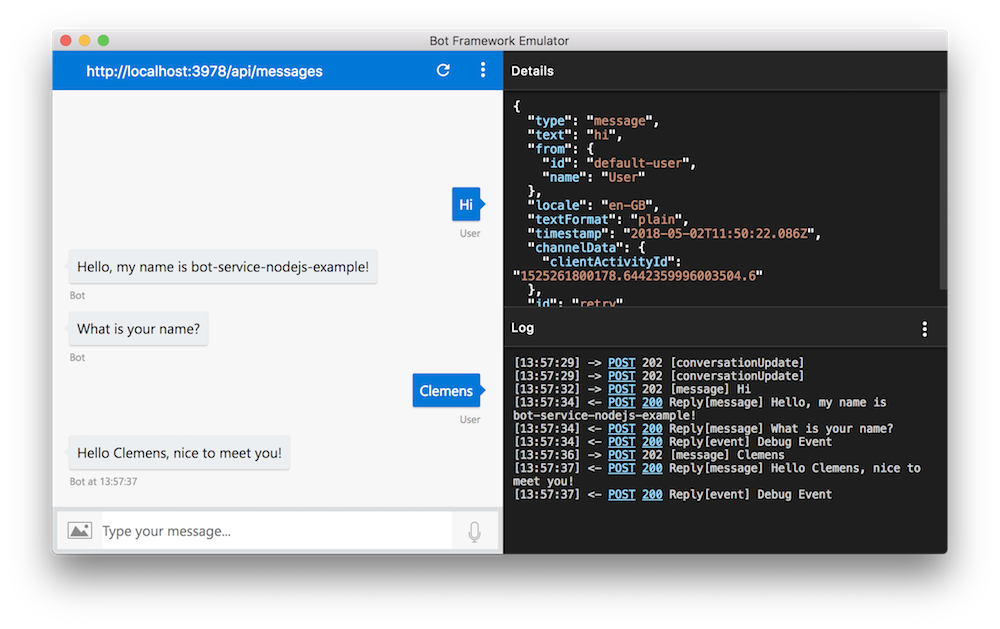

# bot-service-nodejs-example

A simple example of a Node.js based chatbot using [Azure Bot Service](https://docs.microsoft.com/en-us/azure/bot-service/).

## Instructions

First, create a new Storage Account in Azure, copy the connection string and also create an empty Table for persisting the bot's state.

Then, in a terminal, execute:

```
$ git clone https://github.com/csiebler/bot-service-nodejs-example.git
$ cd bot-service-nodejs-example
$ npm install
$ cp .env.template .env
$ vi .env
$ node app.js
```

Then connect to `http://localhost:3978/api/messages` via the [Bot Framework Emulator](https://aka.ms/botemulator). No App Id or App Password needed.

Alternatively, you can directly run the example code from VSCode:

```
$ git clone https://github.com/csiebler/bot-service-nodejs-example.git
$ cd bot-service-nodejs-example
$ npm install
$ cp .env.template .env
$ vi .env
$ code .
```

And then hit the green play button and connect via the Bot Framework Emulator.




## Suggestions & Questions

If you have any suggestions or questions, feel free to reach out to me via [@clemenssiebler](https://twitter.com/clemenssiebler)!

## License

Licensed using the MIT License (MIT). For more information, please see [LICENSE](LICENSE).